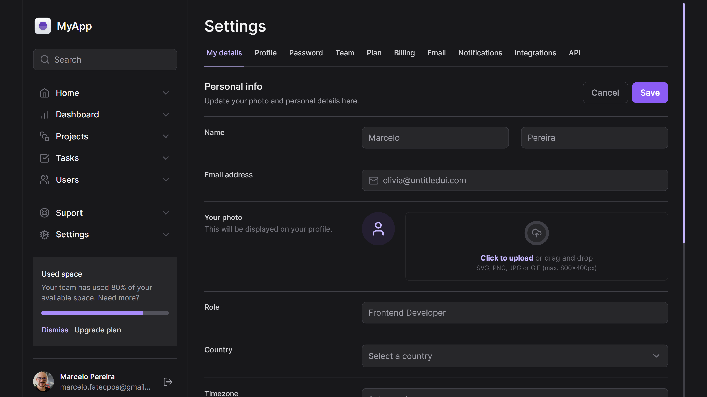

# Tailwind - NextJs

## Sobre o projeto

Interface responsiva de uma dashboard. Este projeto foi desenvolvido em uma Masterclass de Tailwind da Rocketseat - Ignite (Trilha React).

## Tecnologias

- ReactJs
- NextJs
- TypeScript
- TailwindCSS
- Radix UI
- Lucide React Icons

## Deploy

Este projeto foi publicado na **_Vercel_**. Acesse [este link](https://tailwind-nextjs.marcelopereira.dev) para testar a aplicação.
